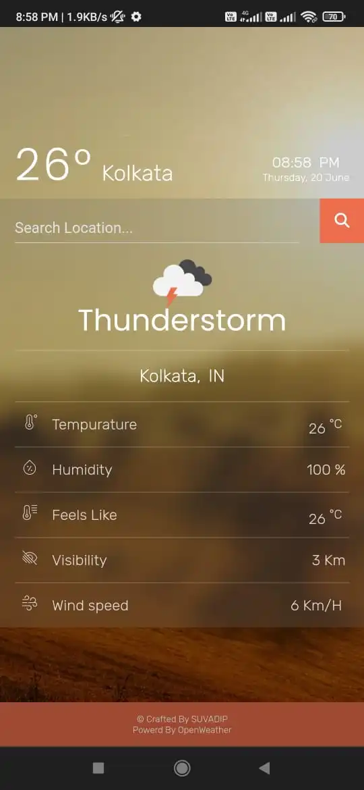

# Weather Application Project (Weather App 2.O)

🌤️ **Weather Application Project** 🌤️

Welcome to the Weather Application project! This application provides current weather data based on the searched location/city, including temperature, humidity, wind speed, visibility, and more. It's designed with a focus on user experience and responsiveness.

## Key Features

- **Current Weather Data**: Get real-time weather information for any city.
- **City and Country Code**: Displays the searched city's country code for added context.
- **Real-Time Updates**: Shows the current time and date.
- **Error Handling**: Robust error management ensures a smooth user experience.
- **Responsive UI**: Attractive and responsive design for all devices, including landscape mode.

## Powered by OpenWeather API

This application uses the reliable [OpenWeather API](https://openweathermap.org/api) to provide accurate and real-time weather data.

## Default Location

By default, the app displays the weather data for Kolkata.

## Live Demo 
Here --> [Weather App](https://suvadip-sana.github.io/new_weather_app/)

## Future Enhancements

- **Geolocation Support**: Plan to integrate geolocation features to provide precise weather data based on the user’s current location (with their permission).
- **Dynamic Backgrounds**: Background image changes based on the local time (day/night) of the searched location.

## Screenshots

### Desktop View

### Mobile View

<!-- 

 -->

## License
Distributed under the MIT License. See LICENSE for more information.

## Contact
1. Linkd In - [Suvadip Sana](https://www.linkedin.com/in/suvadip-sana-b07a14243/)
2. Mail me - suvadipsana602@gmail.com

## Acknowledgements
[OpenWeather API](https://openweathermap.org/api)

- Stay tuned for more updates! 🚀
- Any suggestions will be accepted.

### 🚀 Feel Free To Fork This Repository & Please give this repository a star
